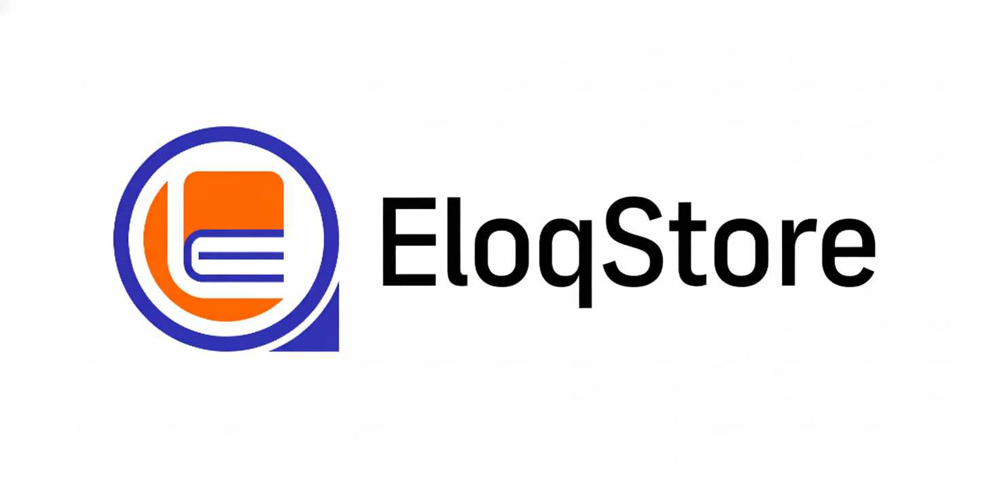
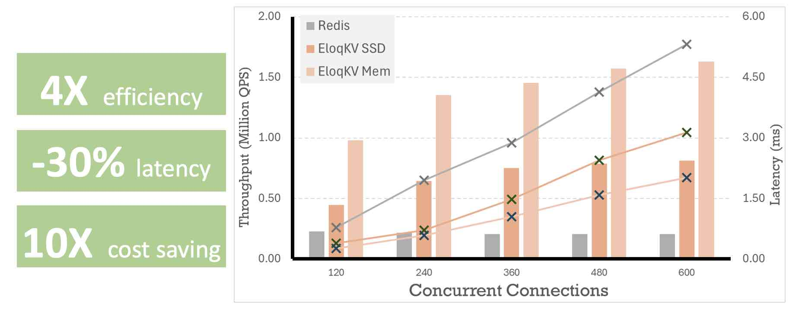

<div align="center">
<a href='https://www.eloqdata.com'>
</img>
</a>

---

[](https://github.com/eloqdata/eloqstore/blob/main/LICENSE.md)
[](https://isocpp.org/)
[](https://github.com/eloqdata/eloqstore/issues)
[](https://www.eloqdata.com/download)
<a href="https://discord.com/invite/nmYjBkfak6">
  
</a>
</div>

# EloqStore

**EloqStore** is a high-performance hybrid-tier key-value storage engine that combines object storage (S3-compatible) with local NVMe SSDs to deliver exceptional write throughput and sub-millisecond read latency. Built in C++ with a focus on production-grade reliability and performance.

EloqStore serves as the foundational storage layer for EloqData's database products ([EloqKV](https://github.com/eloqdata/eloqkv), [EloqDoc](https://github.com/eloqdata/eloqdoc), [EloqSQL]https://github.com/eloqdata/eloqsql), enabling SSD-based workloads to achieve memory-like latency characteristics while maintaining durability and cost efficiency.

For example, EloqKV on EloqStore delivers 4x higher disk access throughput compared to Redis's memory access, with **10x** cost reduction, making it a viable drop-in replacement for Redis.

<div align="center">
<a href='https://www.eloqdata.com'>
</img>
</a>
</div>


## 🏗️ Architecture

EloqStore implements a multi-tier storage architecture:

- **Hot Tier**: In-memory B-tree index with non-leaf nodes cached for O(log n) point lookups
- **Warm Tier**: Local NVMe SSD for frequently accessed data with single I/O point reads
- **Cold Tier**: Object storage (S3-compatible) as the primary durable storage backend

The engine uses a copy-on-write (COW) B-tree structure that enables lock-free reads during batch writes, eliminating read-write contention and ensuring consistent tail latency.

## ✨ Core Features

- **Batch Write Optimization**: Copy-on-write B-tree enables high-throughput batch writes without blocking concurrent reads. MVCC-based design eliminates lock contention and provides predictable write amplification.

- **Point Read Tail Latency Optimization**: In-memory B-tree non-leaf nodes ensure exactly one disk I/O per point read on cold data, delivering consistent P99 latency with deterministic I/O patterns.

- **Object Storage as Primary Storage**: S3-compatible object storage backend provides 11 9's durability, unlimited scalability, and high availability with intelligent caching for low-latency access.

- **Zero-Copy Snapshots**: Copy-on-write semantics enable O(1) snapshot creation without data duplication, supporting point-in-time recovery and consistent backups.

- **Agent Branching**: Instant branch creation for isolated data views in AI/ML workloads, enabling experimentation and multi-tenant isolation without data duplication.

## 🚀 Deployment Models

### Open Source & Self-Hosted

100% open source under BSL 2.0 license. Deploy on-premises or in your cloud infrastructure with full control over data and operations. No vendor lock-in, complete source code access.

### Cloud & Enterprise

Managed service [EloqCloud](https://cloud.eloqdata.com) offering with:
- Serverless architecture (no infrastructure management)
- High performance and fast scaling
- Enterprise-grade security and compliance

## 🌐 Ecosystem

EloqStore exposes a C++ API for direct integration. EloqStore powers different kinds of database products including:

- **Redis/Valkey Protocol**: Drop-in replacement for Redis with persistent storage
- **MongoDB Wire Protocol**: Document database with MongoDB API compatibility
- **SQL Interface**: Relational database with MySQL API compatibility
- **Vector Search**: Native vector indexing and similarity search capabilities

## 🔨 Compile

### Debug Mode

```shell
mkdir build
cd build
cmake .. -DCMAKE_BUILD_TYPE=Debug
cmake --build . -j8
cd ..
```

### Release Mode

```shell
mkdir Release
cd Release
cmake .. -DCMAKE_BUILD_TYPE=Release
cmake --build . -j8
cd ..
```

## 🧪 Testing

### Run Unit Tests

```shell
ctest --test-dir build/tests/
```

### Benchmark

```shell
# An example to run eloqstore with 10GB data, with each record 1K.
# load
./build/benchmark/simple_bench --kvoptions=./benchmark/opts_append.ini --workload=write-read --kv_size=1024 --batch_size=20000 --max_key=10000000 --read_per_part=4 --partitions=1 --load
# run
./build/benchmark/simple_bench --kvoptions=./benchmark/opts_append.ini --workload=write-read --kv_size=1024 --batch_size=20000 --max_key=10000000 --read_per_part=4 --partitions=1
```

## 🤝 Contributing

We welcome contributions from the developer community! 

1. Check [CONTRIBUTING.md](CONTRIBUTING.md) for development guidelines
2. Review [GitHub Issues](https://github.com/eloqdata/eloqstore/issues) for planned features
3. Join our [Discord](https://discord.com/invite/nmYjBkfak6) for discussions
4. Submit PRs for bug fixes, features, or documentation improvements
